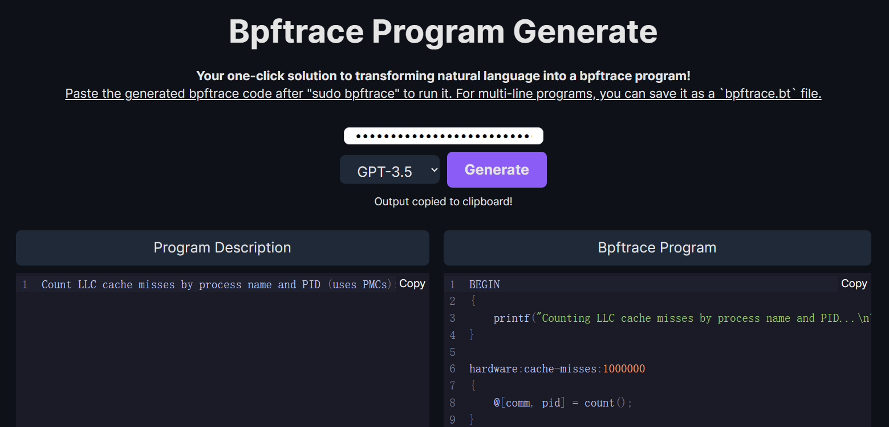

# Bpftrace Program Generation

Transforming natural language into a bpftrace program. See [bpftrace](https://github.com/iovisor/bpftrace) for more detail about bpftrace program.



## Use with Website

You can visit [https://function-call-generate.vercel.app/](https://function-call-generate.vercel.app/) to use this tool online.

Paste the natural language command to the left text box, then copy the corresponding gpt program generated in the right text box to a local file, such as `gpt-bpftrace.bt` file, and then you can easily use the command in the following way:
```console
$sudo bpftrace gpt-bpftrace.bt
```

## Running Locally

**1. Clone Repo**

```bash
git clone https://github.com/eunomia-bpf/GPT2Bpftrace.git
```

**2. Install Dependencies**

```bash
npm i
```

**3. Run App**

```bash
npm run dev
```
